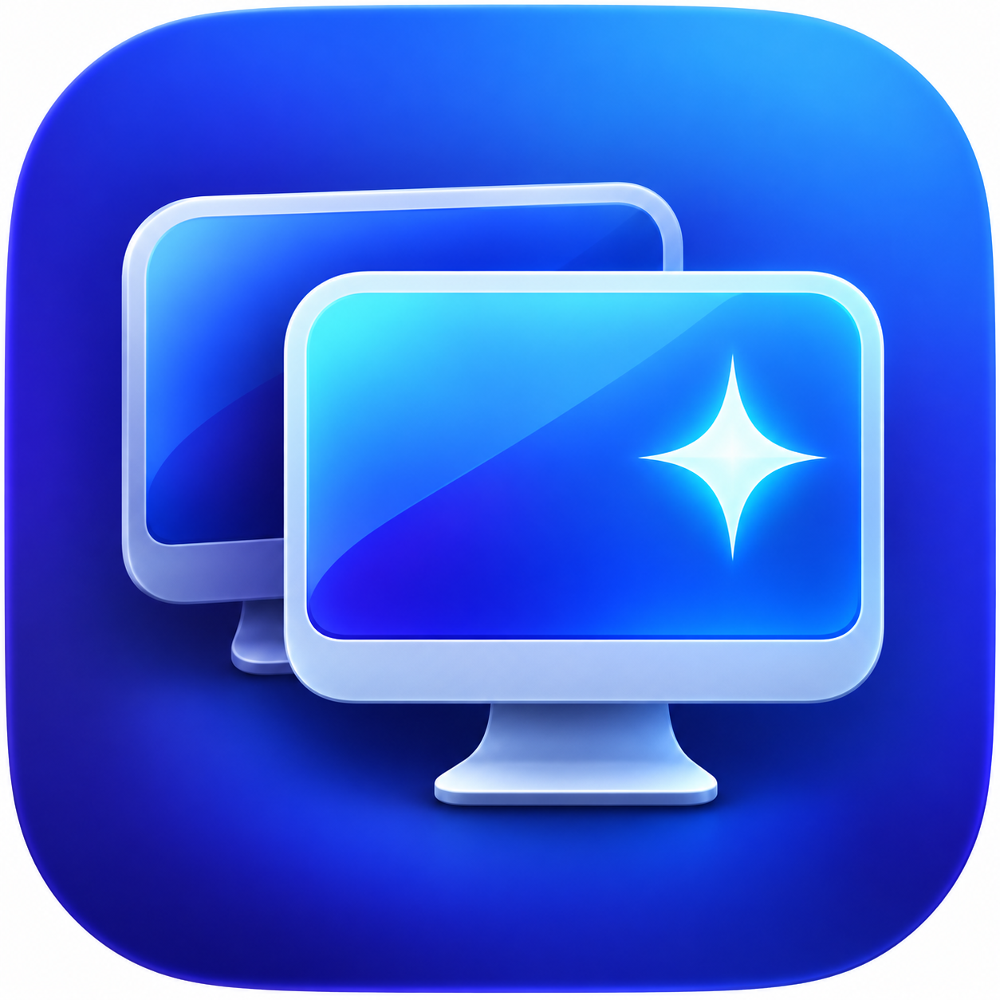

# Retina Dummy

Retina Dummy 是一个轻量的 macOS 菜单栏工具，为无实体显示器的 Mac 创建 HiDPI 虚拟屏幕。适合远程桌面、无头 Mac 和录屏场景。



> 当前版本：0.7.1。下载可运行版本请前往 GitHub Releases；源码可直接使用 Xcode Command Line Tools 构建。

## 功能

- 菜单使用精确的“宽 × 高”数值，不使用含糊的“2K/3K”命名
- 1280×720 至 3840×2160 的常用 HiDPI 预设
- 3440×1440 超宽屏 HiDPI 预设
- 自定义 HiDPI 分辨率，支持 640×480 至 5120×4320 逻辑尺寸
- iPad mini、iPad/Air 11″、iPad Pro 11″、iPad Air 13″ 和 iPad Pro 13″ 横屏 HiDPI 预设
- 所有预设均使用 2× Retina 渲染
- 可同时创建 1–3 个虚拟显示器
- 菜单栏快速开关和模式切换
- 30、60、75、90、120 和 144Hz 刷新率选择
- 可选登录时自动启动
- 本地运行，不收集数据，不需要网络

## 兼容性

- macOS 13.0 或更高版本
- 主要面向 Apple Silicon Mac

> [!WARNING]
> 本应用使用 macOS 非公开 CoreGraphics 虚拟显示器接口。它不适合 Mac App Store，且 macOS 更新后可能需要适配。

4K、超宽屏或同时启用多个显示器会明显增加 GPU 与统一内存占用。

## 安装

1. 从 Releases 下载最新的 DMG 或 ZIP。
2. 将 `Retina Dummy.app` 拖入“应用程序”。
3. 首次启动后，在菜单栏选择需要的分辨率。

由于当前公开构建使用 ad-hoc 签名且尚未经过 Apple 公证，macOS 可能提示无法验证开发者。你可以在“系统设置 → 隐私与安全性”中确认来源后打开。不要从非本项目 Releases 的第三方链接下载。

## 卸载

1. 在菜单栏取消“登录时自动启动”。
2. 退出 Retina Dummy。
3. 将应用移到废纸篓。
4. 可选：删除 `~/Library/Preferences/local.liang.RetinaDummy.plist` 以清除设置。

## 本地构建

需要 Xcode Command Line Tools。

```sh
chmod +x build.sh scripts/release.sh
./build.sh
```

默认使用 ad-hoc 签名，适合本机测试。正式分发时：

```sh
SIGNING_IDENTITY="Developer ID Application: Your Name (TEAMID)" ./build.sh
```

## 签名、DMG 和 Apple 公证

```sh
SIGNING_IDENTITY="Developer ID Application: Your Name (TEAMID)" \
NOTARY_PROFILE="retina-dummy-notary" \
./scripts/release.sh
```

`NOTARY_PROFILE` 是使用 `xcrun notarytool store-credentials` 预先保存的钥匙串配置名。未设置时，脚本只生成 DMG，不会提交公证。

## 隐私和许可

详见 [PRIVACY.md](PRIVACY.md) 和 [MIT License](LICENSE)。

## 技术说明与致谢

虚拟显示器实现基于 macOS 非公开的 `CGVirtualDisplay` 类族。开发与兼容性调试参考了 [BetterDummy](https://github.com/waydabber/BetterDummy) 和 [hidpi-mirror](https://github.com/pasky/hidpi-mirror) 等开源项目的公开技术资料。
